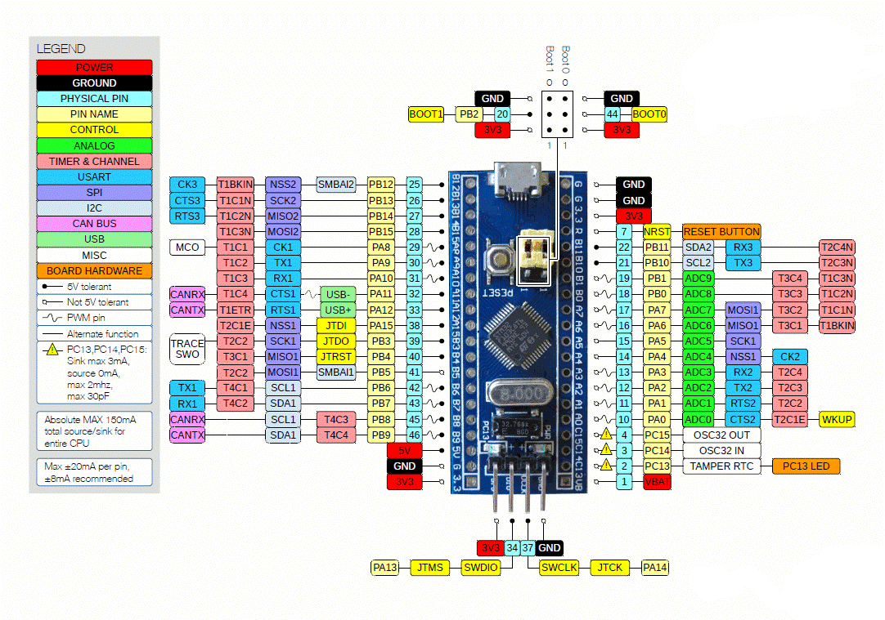

stm32虚拟串口
######################################

.. note:: 使用虚拟串口波特率不起作用，任何波特率都可以用。

硬件资源
*********************************************

|

.. image:: stm32虚拟串口/stm32f103c8t6原理图.png
    :align: center
    :width: 550px

|

|

配置
*********************************************

时钟配置
=============================================

|

|

USB外设配置
=============================================

|

|

测试代码
=============================================

.. code-block:: c

    #include "usbd_cdc_if.h"

    // USB不需要重新插拔
    void USB_Reset(void)
    {
        GPIO_InitTypeDef GPIO_InitStruct = {0};
        __HAL_RCC_GPIOA_CLK_ENABLE();
        GPIO_InitStruct.Pin = GPIO_PIN_12;
        GPIO_InitStruct.Mode = GPIO_MODE_OUTPUT_PP;
        GPIO_InitStruct.Pull = GPIO_NOPULL;
        GPIO_InitStruct.Speed = GPIO_SPEED_FREQ_LOW;
        HAL_GPIO_Init(GPIOA, &GPIO_InitStruct);
        HAL_GPIO_WritePin(GPIOA,GPIO_PIN_12,GPIO_PIN_RESET);
        HAL_Delay(100);
        HAL_GPIO_WritePin(GPIOA,GPIO_PIN_12,GPIO_PIN_SET);
    }

    int main(void)
    {
        /* USER CODE BEGIN 1 */
        uint8_t helloStr[]="hello world\r\n";

        /* USER CODE END 1 */

        /* MCU Configuration--------------------------------------------------------*/

        /* Reset of all peripherals, Initializes the Flash interface and the Systick. */
        HAL_Init();

        /* USER CODE BEGIN Init */
        USB_Reset();
        /* USER CODE END Init */

        /* Configure the system clock */
        SystemClock_Config();

        /* USER CODE BEGIN SysInit */

        /* USER CODE END SysInit */

        /* Initialize all configured peripherals */
        MX_GPIO_Init();
        MX_USB_DEVICE_Init();
        /* USER CODE BEGIN 2 */

        /* USER CODE END 2 */

        /* Infinite loop */
        /* USER CODE BEGIN WHILE */
        while (1)
        {
            /* USER CODE END WHILE */

            /* USER CODE BEGIN 3 */
            CDC_Transmit_FS(helloStr,sizeof(helloStr));
            HAL_Delay(1000);
        }
        /* USER CODE END 3 */
    }

测试结果
*********************************************

.. image:: stm32虚拟串口/screenshots.gif
    :align: center
    :width: 600px

|