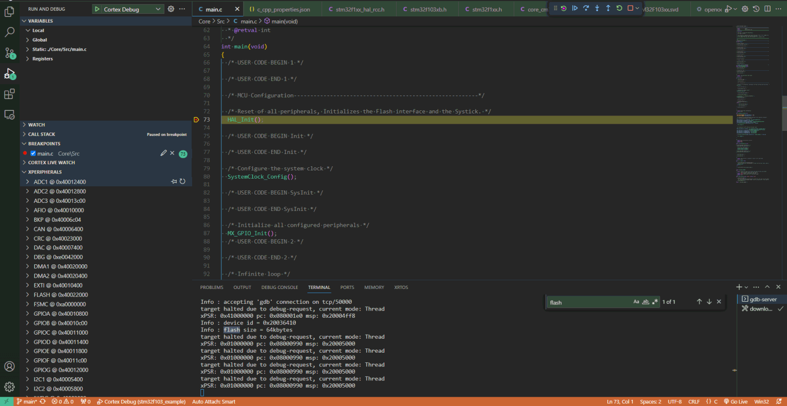

vscode+openocd+stm32环境搭建
#############################################

参考工程 👉 `github stm32f103_example <https://github.com/czc13611858691/stm32f103_example>`_ 

.. toctree::
   :maxdepth: 2
   :numbered:

   vscode_openocd/工具链
   vscode_openocd/参考配置文件

