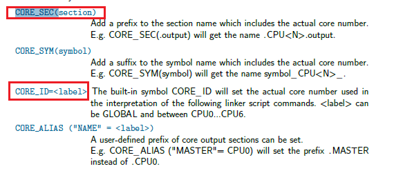

Hightec免费工具链_链接脚本学习
######################################

免费工具链网址申请链接(1年)
*********************************************

https://free-entry-toolchain.hightec-rt.com/

简介
*********************************************

tricore-gcc 的链接脚本是以 ``lsl`` 为后缀的文件。

安装完工具链后，安装目录下会包含 ``ld.pdf`` 和 ``usersguide.pdf`` 文件。

上述两个文件包含了链接脚本的介绍。

`link文件参考 <https://github.com/czc13611858691/TC264/blob/master/1_ToolEnv/0_Build/1_Config/Config_Tricore_Gnuc/Lcf_Gnuc_Tricore_Tc.lsl>`_ 

一个简单的例子
*********************************************

参考文章 `链接脚本(Linker Scripts)语法和规则解析(自官方手册) <https://www.cnblogs.com/jianhua1992/p/16852784.html>`_ 

代码应在地址 0x10000 处加载，数据应从地址 0x8000000 开始。

.. code-block:: c

    SECTIONS
    {
    . = 0x10000;
    .text : { *(.text) }
    . = 0x8000000;
    .data : { *(.data) }
    .bss : { *(.bss) }
    }

程序起始点定义
*********************************************

.. code-block:: 

   ENTRY(symbol)

iLLD 工程中定义如下:

.. code-block:: 

    ENTRY(_START)

程序起始地址为:

.. code-block:: c

    void _START(void)
    {
        Ifx_Ssw_jumpToFunction(__StartUpSoftware);
    }

text bss data rodata
*********************************************

- .text ：程序代码
- .rodata ：只读数据
- .data ：可读写且需要初始化数据
- .bss ：可读写的置零初始化数据

REGION_ALIAS 内存段重命名
*********************************************

.. code-block:: c

    REGION_ALIAS( default_ram , dsram0)
    REGION_ALIAS( default_rom , pfls0)
    

注释的方式
*********************************************

.. code-block:: c

    /*Un comment one of the below statement groups to enable CpuX DMI RAM to hold global variables*/

中断向量表
*********************************************

.. code-block:: c

    inttab_tcx_y

`x` 代表核心 , `y` 代表优先级

每个核心都有一组中断向量表，每个优先级占用 32 字节的内存地址。

__clear_table 和 __copy_table
*********************************************

有初始值和没有初始值的全局变量分别需要在程序运行之前被重新赋值和清空。也就是所谓的 `data` 段和 `bss` 段的区别。

iLLD demo 工程中是放在 ``Ifx_Ssw_C_Init`` 函数中进行的。

获取链接文件中定义值的方式
*********************************************

参考如下:

**link文件中**

.. code-block:: c

    PROVIDE(__copy_table = .);

   

**代码中**

.. code-block:: c

    extern unsigned int __copy_table[];   /**< copy table entry */
    pTable = (unsigned int *)&__copy_table;

.data段 link文件定义详解
*********************************************

参考代码如下:

.. code-block:: c

    CORE_ID = CPU3 ;
    SECTIONS
    {
        /*DSRAM3 Sections*/
        CORE_SEC(.data) : FLAGS(awl)
        {
            *Ifx_Ssw_Tc3.* (.data)
            *Cpu3_Main.* (.data)
            *(.data_cpu3)
            *(.data_cpu3.*)
            . = ALIGN(2);
        } > dsram3 AT> pfls0

    CORE_ID & CORE_SEC

后面定义的data段可以用 ``.CPU3.data`` 表示

> xx 代表变量位于的区域。

AT> 代表变量初始值加载的地址。

ROM 的地址被称作 LMA，获取他们值的方式可以参考如下:

.. code-block:: c

    LONG(LOADADDR(.data));

   

RAM 的地址被称作 VMA

.. code-block:: c

    LONG(0 + ADDR(.data));

获取段的大小可以用 sizeof 关键词

.. code-block:: c

    LONG(SIZEOF(.data));
    

设置段的绝对地址
*********************************************

参考中断向量表

.. code-block:: c

    LCF_INTVEC0_START = 0x802FE000;
    __INTTAB_CPU0 = LCF_INTVEC0_START;
    .inttab_tc0_000 (__INTTAB_CPU0 + 0x0000) : { . = ALIGN(8) ;  KEEP (*(.intvec_tc0_0  )); }

内存块定义时 attr属性
*********************************************

.. code-block:: 

    <name> [(<attr>)] : ORIGIN = <origin>, LENGTH = <len>
    dsram3_local (w!xp): org = 0xd0000000, len = 96K

- R Read-only section.
- W Read/write section.
- X Executable section.
- A Allocatable section.
- I Initialized section.
- L Same as I.
- P Section contains PCP code or data.
- ! Invert the sense of any of the preceding attributes.

FLAGS
*********************************************

.. code-block:: 

   [FLAGS(section_flags)]

- a section is allocatable
- w section is writable
- v section contains vle code
- x section is executable
- l section is loadable

方式1
=============================================

例子如下:

.. code-block:: c

    CORE_SEC(.text) : FLAGS(axl)
    CORE_SEC(.bss) (NOLOAD): FLAGS(aw)
    CORE_SEC(.data) : FLAGS(awl)
    CORE_SEC(.rodata) : FLAGS(arl)

比如说你定义的内存段希望有初始值，那么就需要加上 ``al`` 标志，并在 __copy_table__ 中将其 VMA 和 LMA 加进去。

方式2
=============================================

.. code-block:: c

    #pragma section "<name>" [<flags>] [<alignment>]
    <objects>
    #pragma section

    #pragma section ".bmhd_0_orig" a
    #pragma section

方式3
=============================================

.. code-block:: c

    __attribute__ ((asection("<name>", "a=<align>", "f=<flags>")))