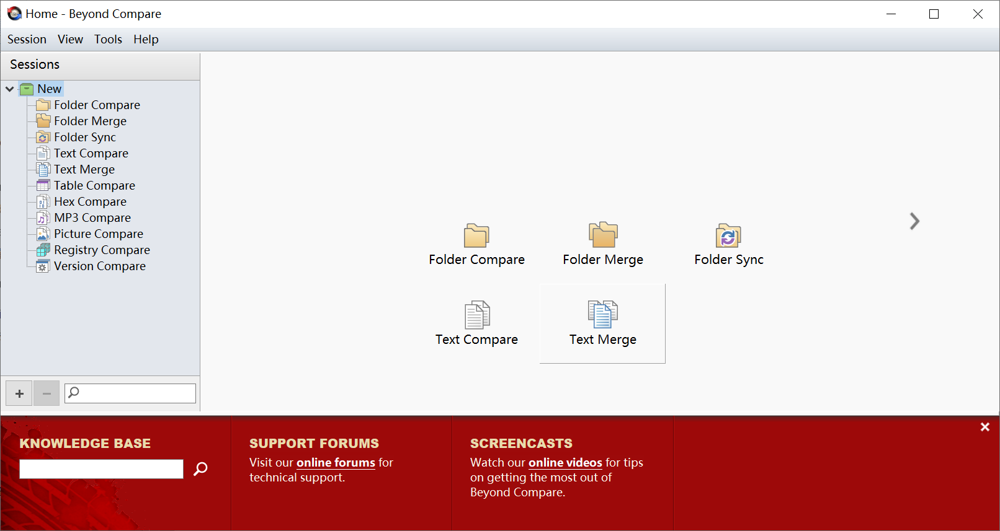
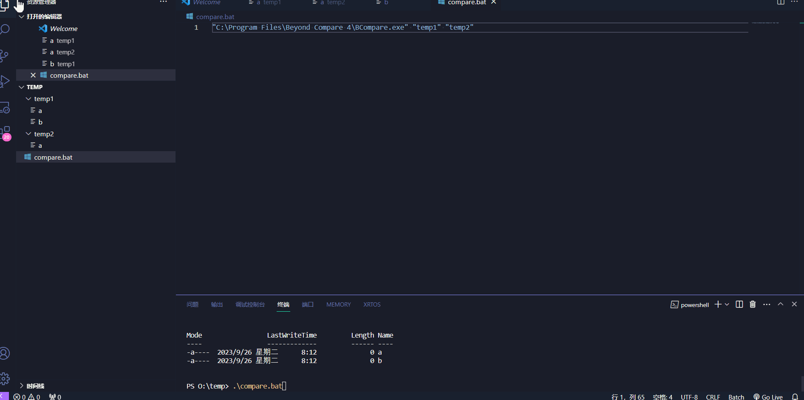
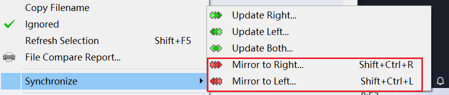
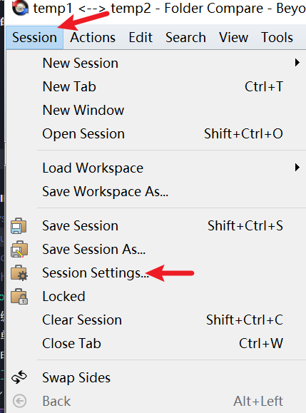
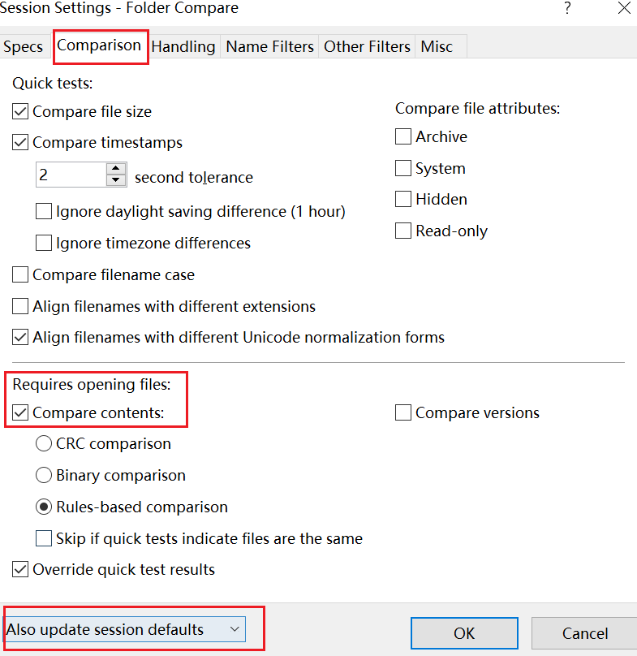

beyond
######################################

简介
*********************************************

beyond 是一款比较文件和文件夹的工具，在我们使用 git 或者 svn 进行提交时，常常需要合并各个分支，这与 vscode 自带的比较工具相比较其更方便。

    产品图片

比较文件夹命令行调用
*********************************************

每次选择相对路径不是那么容易找到的文件夹或者常用的文件夹比较时写个 bat 脚本还是蛮方便的'✨

BCompare.exe(自己电脑安装 BCompare.exe 的路径) "C:\\左侧文件夹" "C:\\右侧文件夹"

**compare.bat**

.. code:: bat

   "C:\Program Files\Beyond Compare 4\BCompare.exe" "temp1" "temp2"

    比较文件夹 bat 命令行演示

beyond 镜像功能
*********************************************

镜像和复制的区别与优点，镜像文件夹或者文件的时候只会识别内容不同的文件，而不会将所有的文件全部复制粘贴。

选择需要操作的文件，然后选择同步-->镜像到左侧/右侧

    镜像

比较时界面显示有差异，打开无差异的现象
*********************************************

https://blog.csdn.net/qq_43592064/article/details/119565913

BeyondCompare比较时界面显示有差异，打开无差异的现象，这个博客里有解决方法

会话设置 --> 比较 --> 比较内容 and 基于规则的比较 and 更新默认会话值

    会话设置

    配置选项