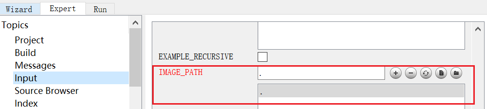
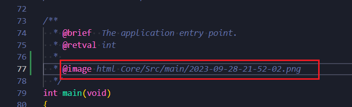
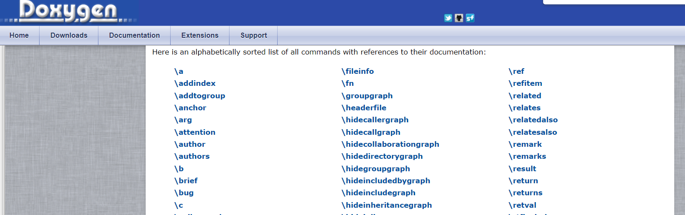

doxygen
######################################

doxygen 是一种可以抽取C语言(不局限于C语言)中注释生成文档的一种工具。

.. figure:: doxygen/2023-09-28-21-34-20.png
    :align: center
    :figwidth: 750px

    doxygen生成文档效果图

如何安装doxygen的文章资料
*********************************************

- `官方下载地址✨ <https://www.doxygen.nl/download.html>`_ 
- `CSDN - 【Doxygen】Doxygen使用教程（个人总结） <https://blog.csdn.net/qq_43331089/article/details/124489068>`_ 
- `CSDN - Graphviz安装配置教程（图文详解） <https://blog.csdn.net/qq_42257666/article/details/121688656>`_ 
- `Doxygen 下载路径 🏆 <https://www.doxygen.nl/download.html>`_ 

.. figure:: doxygen/2023-09-28-21-30-59.png
    :align: center
    :figwidth: 550px

    doxygen windows版本下载

- `Graphviz 下载路径👓 <https://graphviz.gitlab.io/_pages/Download/windows/graphviz-2.38.msi>`_ 

配置笔记
*********************************************
Doxygen 安装完成后可以使用图形化界面配置，配置文件默认叫 Doxyfile

Graphviz 可以生成函数关系图

.. figure:: doxygen/2023-09-28-21-22-26.png
    :align: center
    :figwidth: 300px

Graphviz 安装完之后需要将其 bin 文件夹添加到 **环境变量** 中

.. figure:: doxygen/2023-09-28-21-25-14.png
    :align: center
    :figwidth: 550px

配置文件 Doxyfile
*********************************************

下图是我配置的文件，可以直接导入 Doxygen Gui 进行一定修改，免去下次所有选项重新配置的工作.

.. figure:: doxygen/2023-09-28-21-27-18.png
    :align: center
    :figwidth: 550px

:download:`Doxyfile <doxygen/Doxyfile>` 

如何在代码中插入图片
*********************************************

如果只是单纯的生成一个文档对于我来说意义不是很大，但是如果能文档中插入图片那就有点秀了。

效果演示
=============================================
.. figure:: doxygen/2023-09-28-22-01-38.png
    :align: center
    :figwidth: 550px

    图片有点大😝

.. note:: 图片大的解决方案可以在后面加上 ``width=10cm`` 之类的语句可以控制宽度

doxygen gui配置
=============================================

代码增加注释如下
=============================================

vscode插件-Doxygen
*********************************************
vcode 中在 C语言文件中 输入 ``/**`` 然后按 ``Enter`` 就会自动生成 doxygen 注释

下载插件 ``Doxygen Documentation Generator``

.. figure:: doxygen/2023-09-29-19-14-18.png
    :align: center
    :figwidth: 550px

    Doxygen Documentation Generator

参考配置如下:

.. code-block:: json

    // Doxygen documentation generator set
    "doxdocgen.file.copyrightTag": [
        "@copyright Copyright (c) {year} xxx"
    ],
    "doxdocgen.file.customTag": [
        "@par 修改日志:",
        "<table>",
        "<tr><th>Date       <th>Version <th>Author  <th>Description",
        "<tr><td>{date} <td>0.0     <td>xxx     <td>内容",
        "</table>",
    ],
    "doxdocgen.file.fileOrder": [
        "file",
        "brief",
        "author",
        "version",
        "date",
        "empty",
        "copyright",
        "empty",
        "custom"
    ],
    "doxdocgen.file.fileTemplate": "@file {name}",
    "doxdocgen.file.versionTag": "@version 0.0",
    "doxdocgen.generic.authorEmail": "xxx@xxx.com",
    "doxdocgen.generic.authorName": "xxx",
    "doxdocgen.generic.authorTag": "@author {xxx} ({xxx@xxx.com})",
 
    "doxdocgen.generic.order": [
        "brief",
        "tparam",
        "param",
        "return"
    ],
    "doxdocgen.generic.paramTemplate": "@param{indent:8}{param}{indent:25}xxx",
    "doxdocgen.generic.returnTemplate": "@return {type} ",
    "doxdocgen.generic.splitCasingSmartText": true,

doxygen语法
*********************************************

`官网语法 command🔗 <https://www.doxygen.nl/manual/commands.html>`_ 

    Doxygen

.. csv-table:: doxygen command
    :file: doxygen/DoxygenCmd.csv
    :widths: 30,40,50
    :header-rows: 1
