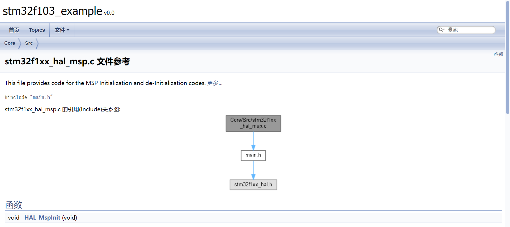
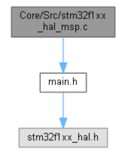
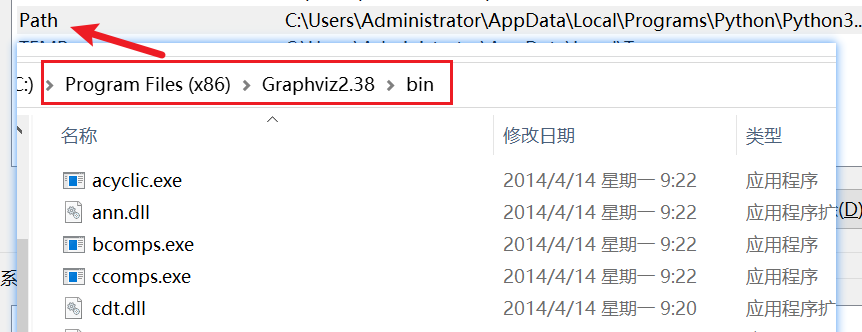
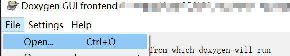

doxygen
######################################

doxygen 是一种可以抽取C语言(不局限于C语言)中注释生成文档的一种工具。

    doxygen生成文档效果图

参考文章资料
*********************************************

- `官方下载地址✨ <https://www.doxygen.nl/download.html>`_ 
- `CSDN - 【Doxygen】Doxygen使用教程（个人总结） <https://blog.csdn.net/qq_43331089/article/details/124489068>`_ 
- `CSDN - Graphviz安装配置教程（图文详解） <https://blog.csdn.net/qq_42257666/article/details/121688656>`_ 
- `Doxygen 下载路径 🏆 <https://www.doxygen.nl/download.html>`_ 

.. figure:: doxygen/2023-09-28-21-30-59.png
    :align: center
    :figwidth: 550px

    doxygen windows版本下载

- `Graphviz 下载路径👓 <https://graphviz.gitlab.io/_pages/Download/windows/graphviz-2.38.msi>`_ 

配置注意事项
*********************************************
Doxygen 安装完成后可以使用图形化界面配置，配置文件默认叫 Doxyfile

Graphviz 可以生成函数关系图

Graphviz 安装完之后需要将其 bin 文件夹添加到 **环境变量** 中

Doxyfile
*********************************************

下图是我配置的文件，可以直接导入 Doxygen Gui 进行一定修改，免去下次所有选项重新配置的工作.

:download:`Doxyfile <doxygen/Doxyfile>` 
   