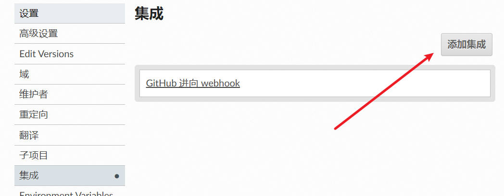
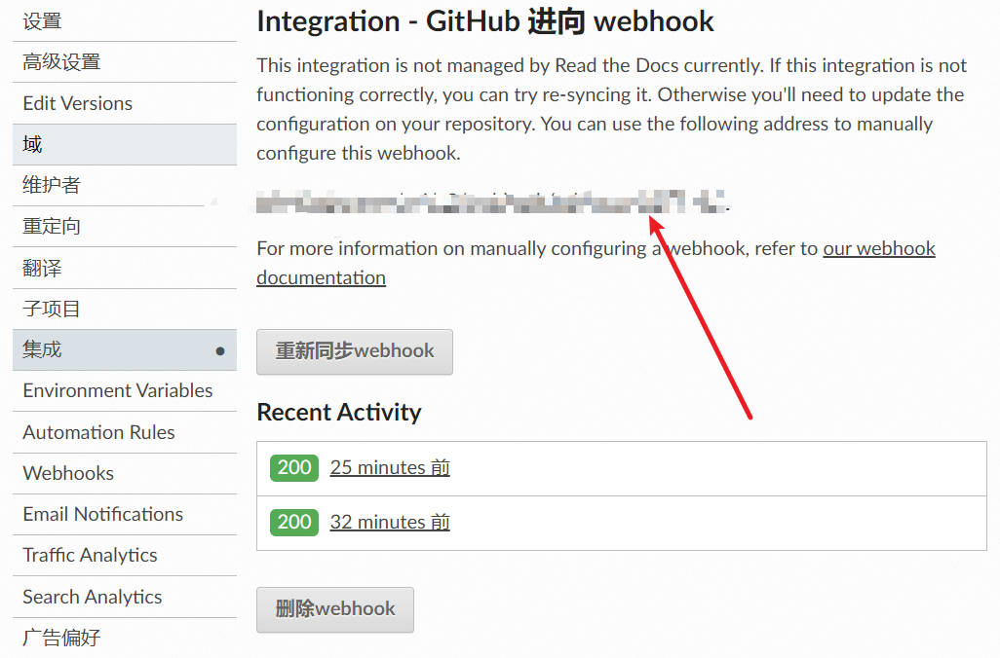
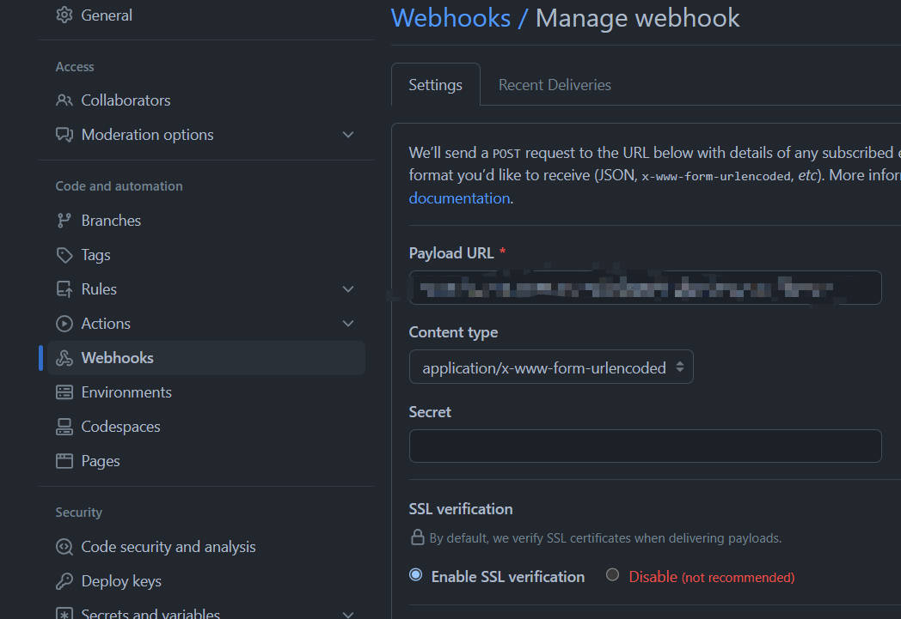

readthedocs构建
########################

官网链接 `👇 <https://readthedocs.org/>`_ 

1. readthedocs 参考配置文件

仓库根目录下添加 ``.readthedocs.yaml``

.. code-block:: yaml

    # .readthedocs.yaml
    # Read the Docs configuration file
    # See https://docs.readthedocs.io/en/stable/config-file/v2.html for details

    # Required
    version: 2

    # Set the OS, Python version and other tools you might need
    build:
    os: ubuntu-22.04
    tools:
        python: "3.7"
        # You can also specify other tool versions:
        # nodejs: "19"
        # rust: "1.64"
        # golang: "1.19"

    # Build documentation in the "docs/" directory with Sphinx
    sphinx:
    configuration: source/conf.py

    # Optionally build your docs in additional formats such as PDF and ePub
    formats:
    - pdf
    #    - epub

    # Optional but recommended, declare the Python requirements required
    # to build your documentation
    # See https://docs.readthedocs.io/en/stable/guides/reproducible-builds.html
    python:
    install:
    - requirements: requirements.txt

python 构建 sphinx 需要安装的库

.. code-block:: text

    sphinx_copybutton==0.5.2
    sphinx==5.3.0
    sphinx_rtd_theme==1.3.0
    jieba==0.42.1
    urllib3==1.23

2. webhook配置

readthedocs 项目中添加集成 github

复制其中的 api 链接

|

|

github 仓库配置 webhook

填入之前复制的链接

|
|

