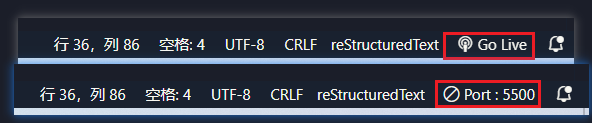
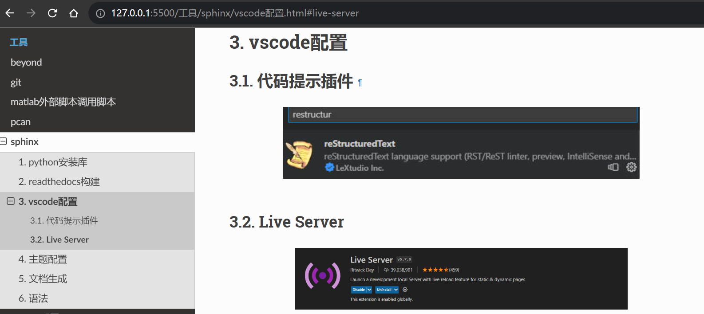

vscode配置
#########################

代码提示插件
*************************

.. image:: media/vscode插件rst.jpg
    :align: center

|

Live Server
*************************
.. image:: media/vscode插件live_server.jpg
    :align: center
    :width: 500px

|

实时更新 html 文档

**配置**

.. figure:: media/2023-09-25-23-21-43.png
    :align: center
    :figwidth: 550px

    配置选项

点击进入后输入如下文本:

.. code-block:: 

   "liveServer.settings.root": "/build/html",

sphinx 工程编译后的默认 index.html 存放在 /build/html 路径下，按照如上配置后，便可以直接在 vscode 右下角打开和关闭文档的实时预览。

    插件打开关闭按钮

    效果演示