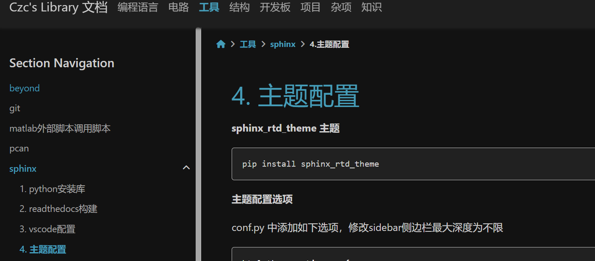

pydata_sphinx_theme主题
######################################

python版本和库的版本
*********************************************

**python 3.7.0**

conf.py
*********************************************
.. code-block:: python

    html_theme = "pydata_sphinx_theme"
    html_theme_options = {
        'navigation_depth': -1,
        "header_links_before_dropdown": 8
    }

requirements.txt
*********************************************

.. code-block:: text

    accessible-pygments==0.0.4
    alabaster==0.7.13
    Babel==2.12.1
    beautifulsoup4==4.12.2
    certifi==2023.7.22
    charset-normalizer==3.2.0
    colorama==0.4.6
    docutils==0.19
    idna==3.4
    imagesize==1.4.1
    importlib-metadata==6.7.0
    jieba==0.42.1
    Jinja2==3.1.2
    MarkupSafe==2.1.3
    packaging==23.1
    pydata-sphinx-theme==0.13.3
    Pygments==2.16.1
    pytz==2023.3.post1
    requests==2.31.0
    snowballstemmer==2.2.0
    soupsieve==2.4.1
    sphinx==5.3.0
    sphinx-copybutton==0.5.2
    sphinxcontrib-applehelp==1.0.2
    sphinxcontrib-devhelp==1.0.2
    sphinxcontrib-htmlhelp==2.0.0
    sphinxcontrib-jsmath==1.0.1
    sphinxcontrib-qthelp==1.0.3
    sphinxcontrib-serializinghtml==1.1.5
    typing-extensions==4.7.1
    urllib3==1.23
    zipp==3.15.0

效果图
*********************************************

