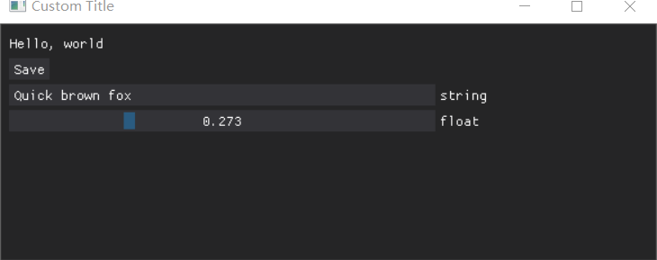
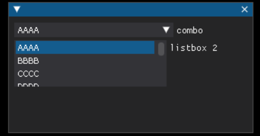
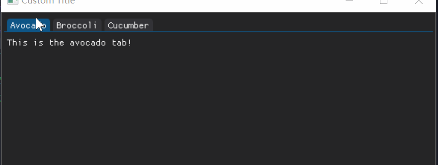
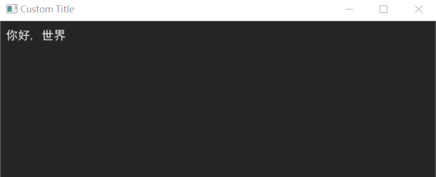
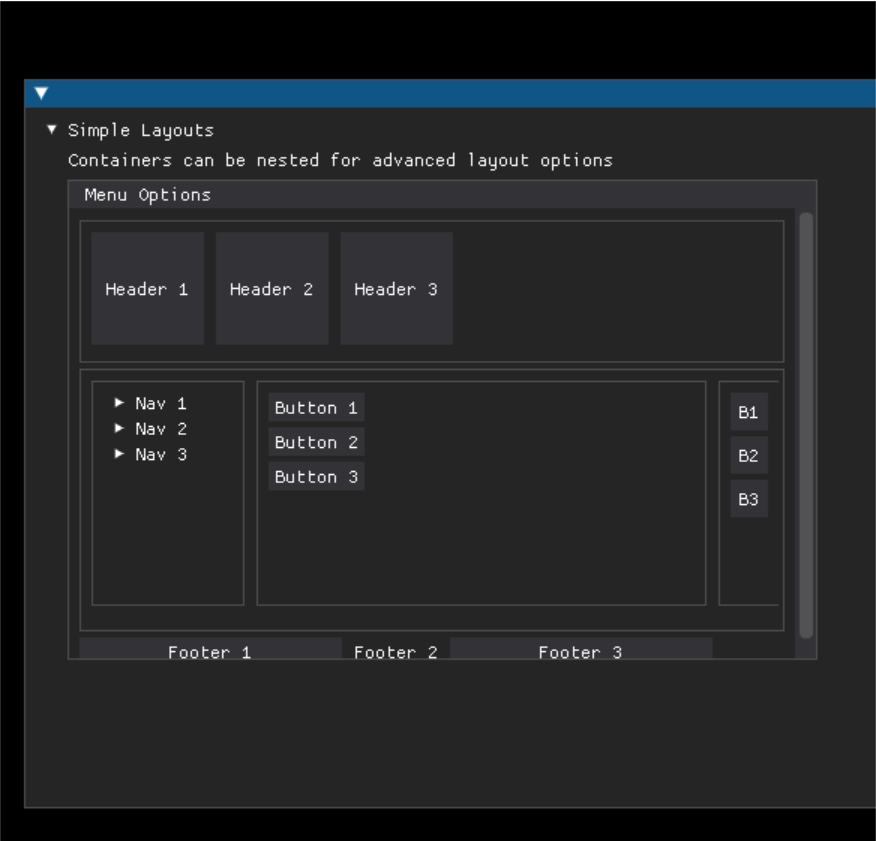

dearpygui
######################################

**版本**

.. code-block:: 

   dearpygui==1.10.0

`官方文档 <https://dearpygui.readthedocs.io/en/latest/index.html>`_ 

install
*********************************************

.. code-block:: bash

    pip install dearpygui

demo.py
*********************************************

.. code-block:: python

    import dearpygui.dearpygui as dpg
    import dearpygui.demo as demo

    dpg.create_context()
    dpg.create_viewport(title='Custom Title', width=600, height=600)

    demo.show_demo()

    dpg.setup_dearpygui()
    dpg.show_viewport()
    dpg.start_dearpygui()
    dpg.destroy_context()

循环渲染
*********************************************

.. code-block:: python

    import dearpygui.dearpygui as dpg

    dpg.create_context()

    with dpg.window(label="Example Window"):
        dpg.add_text("Hello, world")
        dpg.add_button(label="Save")
        dpg.add_input_text(label="string", default_value="Quick brown fox")
        dpg.add_slider_float(label="float", default_value=0.273, max_value=1)

    dpg.create_viewport(title='Custom Title', width=600, height=200)
    dpg.setup_dearpygui()
    dpg.show_viewport()

    # below replaces, start_dearpygui()
    while dpg.is_dearpygui_running():
        # insert here any code you would like to run in the render loop
        # you can manually stop by using stop_dearpygui()
        print("this will run every frame")
        dpg.render_dearpygui_frame()

    dpg.destroy_context()

主窗口
*********************************************
窗口填满

.. code-block:: python

    import dearpygui.dearpygui as dpg

    dpg.create_context()

    with dpg.window(tag="Primary Window"):
        dpg.add_text("Hello, world")
        dpg.add_button(label="Save")
        dpg.add_input_text(label="string", default_value="Quick brown fox")
        dpg.add_slider_float(label="float", default_value=0.273, max_value=1)

    dpg.create_viewport(title='Custom Title', width=600, height=200)
    dpg.setup_dearpygui()
    dpg.show_viewport()
    dpg.set_primary_window("Primary Window", True)
    dpg.start_dearpygui()
    dpg.destroy_context()

    效果演示

组件返回值
*********************************************
组件的返回值可以通过返回值或者 ``tag`` 标签来实现

示例如下:

.. code-block:: python

    b0 = dpg.add_button(label="button 0")
    b1 = dpg.add_button(tag=100, label="Button 1")
    dpg.add_button(tag="Btn2", label="Button 2")

组件后续调用的两种方式
*********************************************

方式1 with
=============================================

.. code-block:: python

    with dpg.window(label="Tutorial"):
        dpg.add_button(label="Button 1")
        dpg.add_button(label="Button 2")
        with dpg.group():
            dpg.add_button(label="Button 3")
            dpg.add_button(label="Button 4")
            with dpg.group() as group1:
                pass

方式2 parent=xx
=============================================

.. code-block:: python

    dpg.add_button(label="Button 6", parent=group1)
    dpg.add_button(label="Button 5", parent=group1)

回调函数
*********************************************

sender就是要发送的组件的标记，也是这个组件的函数返回值。

app_data 是 gui 内部使用的值，一般用来特定的功能，比如文件选择，画图时等等。

user_data 可以用户定义。

.. code-block:: python

    import dearpygui.dearpygui as dpg

    dpg.create_context()

    def button_callback(sender, app_data, user_data):
        print(f"sender is: {sender}")
        print(f"app_data is: {app_data}")
        print(f"user_data is: {user_data}")

    with dpg.window(label="Tutorial"):
        # user data and callback set when button is created
        dpg.add_button(label="Apply", callback=button_callback, user_data="Some Data")

        # user data and callback set any time after button has been created
        btn = dpg.add_button(label="Apply 2", )
        dpg.set_item_callback(btn, button_callback)
        dpg.set_item_user_data(btn, "Some Extra User Data")

    dpg.create_viewport(title='Custom Title', width=800, height=600)
    dpg.setup_dearpygui()
    dpg.show_viewport()
    dpg.start_dearpygui()
    dpg.destroy_context()

get_value获取组件输入值,set_value设置组件的值
*********************************************

**get_value代码示例**

.. code-block:: python

    import dearpygui.dearpygui as dpg

    dpg.create_context()

    def print_value(sender):
        print(dpg.get_value(sender))

    with dpg.window(width=300):
        input_txt1 = dpg.add_input_text()
        # The value for input_text2 will have a starting value
        # of "This is a default value!"
        input_txt2 = dpg.add_input_text(
            label="InputTxt2",
            default_value="This is a default value!",
            callback=print_value
        )

        slider_float1 = dpg.add_slider_float()
        # The slider for slider_float2 will have a starting value
        # of 50.0.
        slider_float2 = dpg.add_slider_float(
            label="SliderFloat2",
            default_value=50.0,
            callback=print_value
        )

        dpg.set_item_callback(input_txt1, print_value)
        dpg.set_item_callback(slider_float1, print_value)

        print(dpg.get_value(input_txt1))
        print(dpg.get_value(input_txt2))
        print(dpg.get_value(slider_float1))
        print(dpg.get_value(slider_float2))

    dpg.create_viewport(title='Custom Title', width=800, height=600)
    dpg.setup_dearpygui()
    dpg.show_viewport()
    dpg.start_dearpygui()
    dpg.destroy_context()

**set_value代码示例**

.. code-block:: python

    import dearpygui.dearpygui as dpg

    dpg.create_context()

    with dpg.window(width=300):
        # Creating a slider_int widget and setting the
        # default value to 15.
        dpg.add_slider_int(default_value=15, tag="slider_int")

    # On second thought, we're gonna set the value to 40
    # instead - for no reason in particular...
    dpg.set_value("slider_int", 40)

    dpg.create_viewport(title='Custom Title', width=800, height=600)
    dpg.setup_dearpygui()
    dpg.show_viewport()
    dpg.start_dearpygui()
    dpg.destroy_context()

波形图
*********************************************

代码
=============================================
.. code-block:: python

    import dearpygui.dearpygui as dpg
    from math import sin

    dpg.create_context()

    # creating data
    sindatax = []
    sindatay = []
    testx = []
    testy = []
    for i in range(10):
        testx.append(i)
        testy.append(i%2)
    for i in range(0, 500):
        sindatax.append(i / 1000)
        sindatay.append(0.5 + 0.5 * sin(50 * i / 1000))

    with dpg.window(label="Tutorial"):
        # create plot
        with dpg.plot(label="Line Series", height=400, width=400):
            # optionally create legend
            dpg.add_plot_legend()

            # REQUIRED: create x and y axes
            dpg.add_plot_axis(dpg.mvXAxis, label="x")
            dpg.add_plot_axis(dpg.mvYAxis, label="y", tag="y_axis")

            # series belong to a y axis
            dpg.add_line_series(
                sindatax, sindatay, label="0.5 + 0.5 * sin(x)", parent="y_axis"
            )
            dpg.add_stair_series(
                testx, testy, label="0.5 + 0.5 * sin(x)", parent="y_axis"
            )

    dpg.create_viewport(title="Custom Title", width=800, height=600)
    dpg.setup_dearpygui()
    dpg.show_viewport()
    dpg.start_dearpygui()
    dpg.destroy_context()

效果
=============================================
.. figure:: dearpygui/2023-09-24-22-08-33.png
    :align: center
    :figwidth: 550px

    效果图

回调函数更新里面值的示例
=============================================
.. code-block:: python

    def update_series():

        cosdatax = []
        cosdatay = []
        for i in range(0, 500):
            cosdatax.append(i / 1000)
            cosdatay.append(0.5 + 0.5 * cos(50 * i / 1000))
        dpg.set_value('series_tag', [cosdatax, cosdatay])
        dpg.set_item_label('series_tag', "0.5 + 0.5 * cos(x)")

自动更新上下限
=============================================
.. code-block:: python

    dpg.set_axis_limits_auto("x_axis")

按钮
*********************************************

.. code-block:: python

   dpg.add_button(label="fit y", callback=xx)

文本输入
*********************************************

.. code-block:: python

    dpg.add_input_text(label="input text (w/ hint)", hint="enter text here", callback=_log)
    dpg.add_input_int(label="input int", callback=_log)
    dpg.add_input_float(label="input float", callback=_log, format="%.06f")
    dpg.add_input_float(label="input float scientific", format="%e", callback=_log)
    dpg.add_input_floatx(label="input floatx", callback=_log, default_value=[1,2,3,4])
    dpg.add_input_double(label="input double", callback=_log, format="%.14f")
    dpg.add_input_doublex(label="input doublex", callback=_log, default_value=[1,2,3,4], format="%.14f")

滑条输入
*********************************************
.. code-block:: python

    dpg.add_slider_int(label="slider int", max_value=3, callback=_log)
    dpg.add_slider_float(label="slider float", max_value=1.0, format="ratio = %.3f", callback=_log)
    dpg.add_slider_double(label="slider double", max_value=1.0, format="ratio = %.14f", callback=_log)
    dpg.add_slider_int(label="slider angle", min_value=-360, max_value=360, format="%d deg", callback=_log)

单选框
*********************************************

.. code-block:: python

    dpg.add_radio_button(("radio a", "radio b", "radio c"), callback=_log, horizontal=True)

复选框
*********************************************

.. code-block:: python

   dpg.add_checkbox(label="checkbox", callback=_log)

下拉列表
*********************************************

代码
=============================================
.. code-block:: python

    import dearpygui.dearpygui as dpg
    import dearpygui.demo as demo

    dpg.create_context()
    dpg.create_viewport(title="Custom Title", width=600, height=600)
    with dpg.window(tag="Primary Window"):
        dpg.add_combo(("AAAA", "BBBB", "CCCC", "DDDD", "EEEE", "FFFF", "GGGG", "HHHH", "IIII", "JJJJ", "KKKK"), label="combo", default_value="AAAA")
        dpg.add_listbox(("AAAA", "BBBB", "CCCC", "DDDD", "EEEE", "FFFF", "GGGG", "HHHH", "IIII", "JJJJ", "KKKK"), label="listbox 2", width=200)

    dpg.setup_dearpygui()
    dpg.show_viewport()
    dpg.start_dearpygui()
    dpg.destroy_context()

效果
=============================================

    combo和listbox的不同

文本输出
*********************************************

.. code-block:: python

   dpg.add_text("hello, i was added from a stage")

分割窗口tabs
*********************************************

代码
=============================================
.. code-block:: python

    with dpg.tab_bar():
        with dpg.tab(label="Avocado"):
            dpg.add_text("This is the avocado tab!")
        with dpg.tab(label="Broccoli"):
            dpg.add_text("This is the broccoli tab!")
        with dpg.tab(label="Cucumber"):
            dpg.add_text("This is the cucumber tab!")

效果
=============================================

    切换窗口示例

中文字体
*********************************************

代码
=============================================

字体文件放在 python 执行目录下，字体文件如下:

:download:`simhei.ttf <dearpygui/simhei.ttf>` 

.. code-block:: python

    import dearpygui.dearpygui as dpg

    dpg.create_context()

    with dpg.font_registry():
        with dpg.font("simhei.ttf", 16) as font1:
            dpg.add_font_range_hint(dpg.mvFontRangeHint_Default)
            dpg.add_font_range_hint(dpg.mvFontRangeHint_Chinese_Simplified_Common)
            dpg.add_font_range_hint(dpg.mvFontRangeHint_Chinese_Full)
        dpg.bind_font(font1)

    with dpg.window(tag="Primary Window"):
        dpg.add_text("你好, 世界")

    dpg.create_viewport(title='Custom Title', width=600, height=200)
    dpg.setup_dearpygui()
    dpg.show_viewport()
    dpg.set_primary_window("Primary Window", True)
    dpg.start_dearpygui()
    dpg.destroy_context()

效果
=============================================

    你好，世界

布局
*********************************************

``tree_node`` 设置缩放

``child_window`` 设置框框

``dpg.group(horizontal=True)`` 可以将一组设置成横的

.. code-block:: python

    with dpg.tree_node(label="Simple Layouts"):
        dpg.add_text("Containers can be nested for advanced layout options")
        with dpg.child_window(width=500, height=320, menubar=True):
            with dpg.menu_bar():
                dpg.add_menu(label="Menu Options")
            with dpg.child_window(autosize_x=True, height=95):
                with dpg.group(horizontal=True):
                    dpg.add_button(label="Header 1", width=75, height=75)
                    dpg.add_button(label="Header 2", width=75, height=75)
                    dpg.add_button(label="Header 3", width=75, height=75)
            with dpg.child_window(autosize_x=True, height=175):
                with dpg.group(horizontal=True, width=0):
                    with dpg.child_window(width=102, height=150):
                        with dpg.tree_node(label="Nav 1"):
                            dpg.add_button(label="Button 1")
                        with dpg.tree_node(label="Nav 2"):
                            dpg.add_button(label="Button 2")
                        with dpg.tree_node(label="Nav 3"):
                            dpg.add_button(label="Button 3")
                    with dpg.child_window(width=300, height=150):
                        dpg.add_button(label="Button 1")
                        dpg.add_button(label="Button 2")
                        dpg.add_button(label="Button 3")
                    with dpg.child_window(width=50, height=150):
                        dpg.add_button(label="B1", width=25, height=25)
                        dpg.add_button(label="B2", width=25, height=25)
                        dpg.add_button(label="B3", width=25, height=25)
            with dpg.group(horizontal=True):
                dpg.add_button(label="Footer 1", width=175)
                dpg.add_text("Footer 2")
                dpg.add_button(label="Footer 3", width=175)

    布局演示